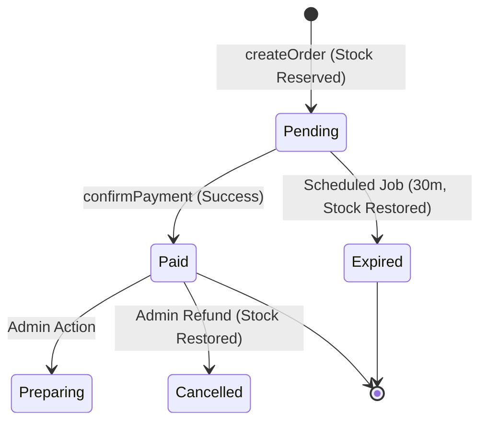

# Production-Grade Order & Payment Architecture

This architecture ensures financial integrity, prevents stock overselling, and handles order lifecycle states automatically using Convex scheduled jobs.

## 1. Order State Machine

## 2. Key Components

### A. Pessimistic Stock Reservation
Instead of waiting for payment to deduct stock, we deduct it at **order creation**. 
- **Benefit**: Prevents multiple users from paying for the last item in stock (race conditions).
- **Graceful Recovery**: If the payment fails or the user abandons the checkout, a scheduled job restores the stock.

### B. Scheduled Expiration (TTL)
We use `ctx.scheduler.runAfter(30, ...)` during order creation to trigger an internal mutation after 30 minutes.
- If the order status is still `Pending`, it switches to `Expired`.
- This automatically triggers the **Stock Restoration** logic.

### C. Financial Integrity (Idempotency & Verification)
In the `/api/verify-payment` route and corresponding Convex mutation:
1. **Idempotency**: We check for an existing `payments` record by `transactionReference` to prevent duplicate processing.
2. **Amount Verification**: We compare the Paystack `amount` (verified via secret key) against the stored `order.totalAmount`.
3. **State Guard**: We strictly reject payments for `Expired` or already `Paid` orders.

## 3. Implementation Details

### Schema Updates
Added `Expired` to the status enum and `expiresAt` timestamp for record-keeping and UI countdowns.

### Mutation Logic (Implemented in convex/orders.ts)
- **`orders:create`**: 
    - Deducts stock.
    - Snapshots product prices to `orderItems` (protection against future price changes).
    - Schedules the `orders:expire` job.
- **`orders:confirmPayment`**:
    - Finalizes status to `Paid`.
    - Clears user cart.
    - Prevents double processing.

## 4. Edge Cases handled

| Scenario | Resolution |
| :--- | :--- |
| **User pays at 31st minute** | The Paystack callback will hit the server, but `confirmPayment` will throw an error because the order is already `Expired`. You can then trigger a refund manually or via webhook. |
| **Race condition: Two users buy last item** | Convex mutations are serializable. The first one will succeed, the second will find `product.stock < quantity` and throw an exception before any state is changed. |
| **Server goes down** | Convex ensures scheduled jobs persist. When the environment resumes, the expiration jobs will run. |
| **Price changes during session** | Line items are snapshotted at creation. The user pays the price they saw at the time of "Confirm Order". |

## 5. Failure Scenarios & Recovery
- **Payment Success but Browser Close**: The `/api/verify-payment` can be triggered via Paystack webhooks (recommended for production) if the client-side redirect fails. Currently, our client-side redirect handles the standard flow.
- **Paystack API Down**: If verification fails, the order remains `Pending` and eventually expires, restoring stock for other customers.
